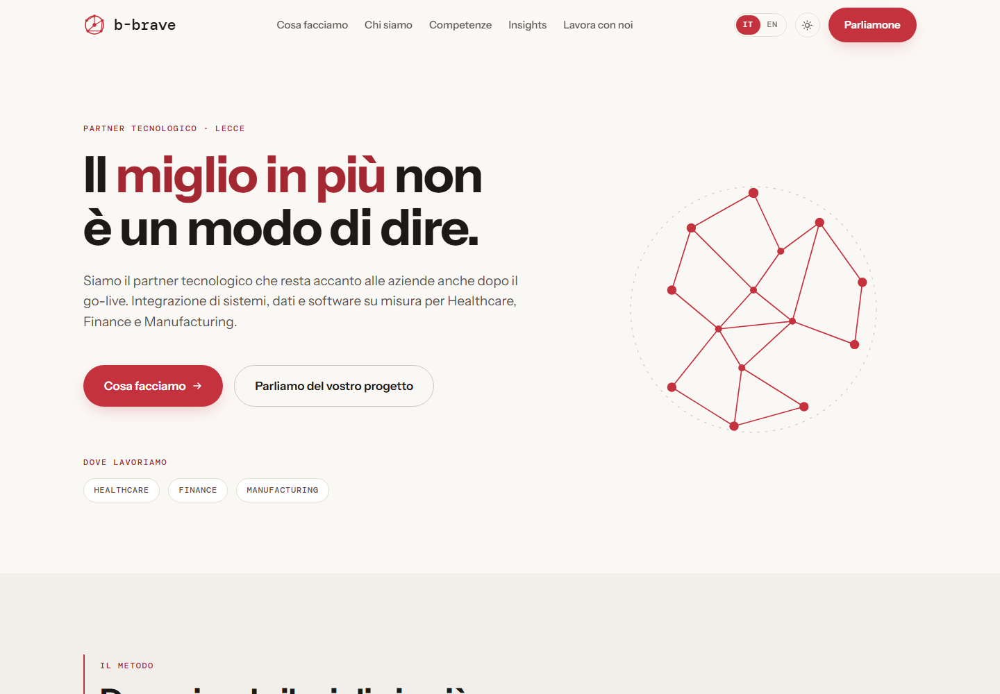
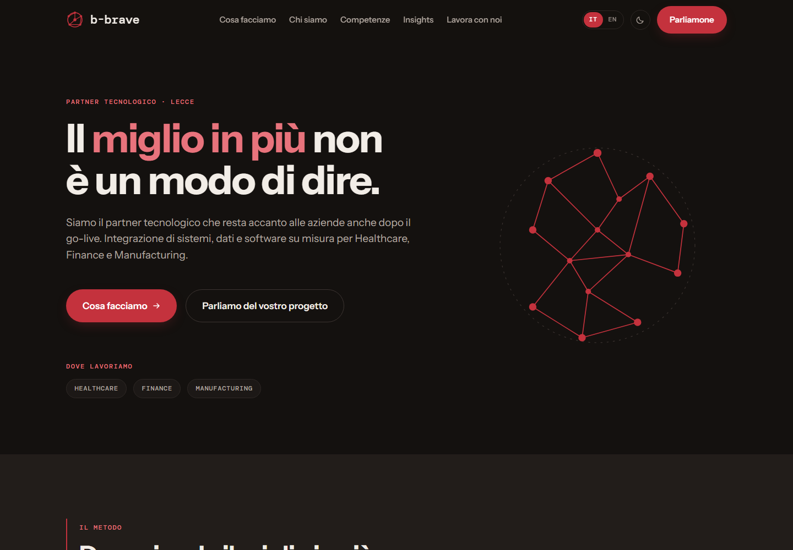
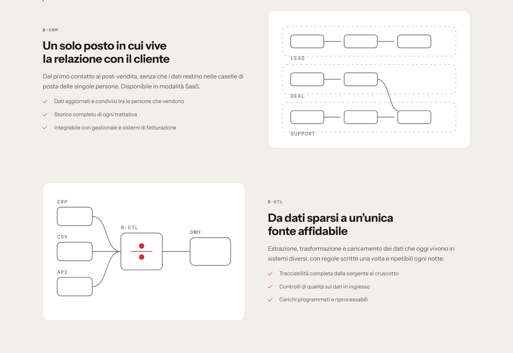
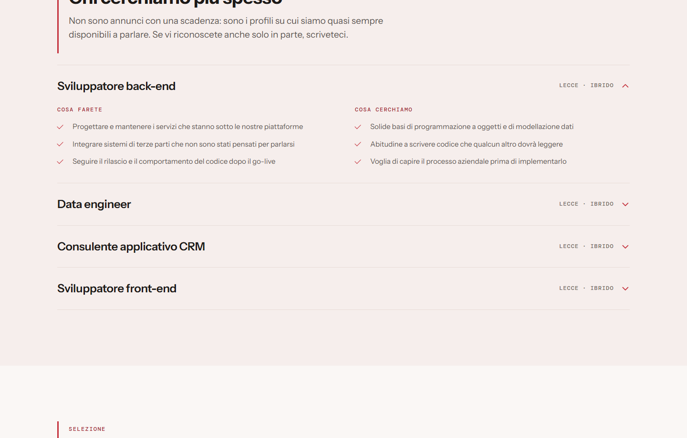
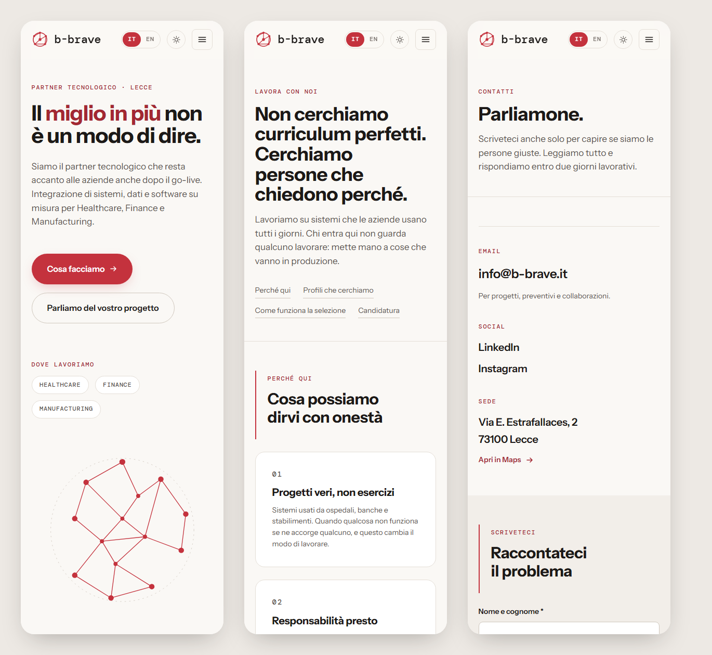

# b-brave — mockup di restyling

Questo è il mockup del sito di cui abbiamo parlato. È un concept: serve a far vedere una direzione e a capire se è quella giusta prima di investirci davvero, non a sostituire b-brave.it.

Il rosso è rimasto quello. Non si discute.

---

## Come lo apri

### → **[saracostanzo.github.io/b-brave](https://saracostanzo.github.io/b-brave/)**

Si apre da qualsiasi browser, anche dal telefono. Non serve altro.

Se preferisci averlo in locale: scarica lo ZIP, **estrai la cartella** e fai doppio clic su `index.html`. L'unica accortezza è estrarlo davvero — se apri `index.html` da dentro lo zip, Windows tira fuori solo quel file e lascia indietro grafica e script, quindi vedresti una pagina spoglia. Estratto funziona subito: niente da installare, niente server, funziona anche senza connessione.

## Cosa c'è dentro

Sette pagine, che seguono la struttura che avete già:

| Pagina | Cosa contiene |
|---|---|
| `index.html` | Home |
| `we-do.html` | Servizi, soluzioni proprietarie e modelli di collaborazione |
| `we-are.html` | Chi siete, i tre pilastri, il manifesto |
| `expertise.html` | Le sei aree di competenza e il metodo |
| `insights.html` | Gli articoli, con filtro per tema |
| `careers.html` | Perché lavorare da voi, i profili, la selezione |
| `contacts.html` | Recapiti, form e dove siete |

In alto a destra ci sono due interruttori: **IT / EN** cambia lingua senza ricaricare la pagina, e l'icona accanto passa dal tema chiaro a quello scuro.

## L'idea

Siete un partner tecnologico che parla con direzioni aziendali di sanità, finanza e manifattura. Volevo che il sito avesse quel tono: chiaro, ordinato, sicuro di sé, senza effetti speciali.

Tre scelte che tengono insieme il resto:

**Il rosso apre e chiude.** Un filetto rosso in cima a ogni pagina, una fascia piena che la chiude, e in mezzo il rosso su pulsanti, etichette, numeri e qualche parola chiave. Anche i fondi chiari sono virati leggermente verso il rosso, invece di restare grigi. Quello che resta fuori sono i blocchi di testo lunghi: se il colore è ovunque smette di significare qualcosa.

**Il vostro marchio è diventato il filo conduttore.** Ho ridisegnato la sfera di nodi del logo in vettoriale, e da quella è nata l'immagine dell'hero: una rete che si disegna al caricamento. Se passi il mouse su Healthcare, Finance o Manufacturing, la rete accende solo il pezzo che riguarda quel settore.

**Nessuna fotografia.** Tutta la grafica è disegnata a mano in SVG: il logo, le icone, i diagrammi delle soluzioni, la mappa nei contatti. Così il sito non dipende da foto stock che invecchiano male, pesa pochissimo e resta coerente ovunque.

E il claim l'ho preso in parola: "Go the extra mile" è diventato il titolo della home, il nome di una sezione e il filetto rosso che in ogni titolo scende un po' più in basso di quanto dovrebbe.

## Cosa ho cambiato rispetto al sito di adesso

Ho fatto un giro sul sito attuale prima di partire. Non per fare le pulci, ma perché un restyling serve a risolvere dei problemi concreti, e questi sono quelli che ho trovato.

| Come è adesso | Cosa ho fatto qui |
|---|---|
| **Blog** e **Join us** sono nel menu ma le due pagine sono vuote | `insights.html` e `careers.html` sono complete; Careers è forse la pagina più utile di tutte |
| I testi sono in inglese, gli articoli in italiano | Tutto in italiano, con la versione inglese completa dietro l'interruttore |
| Qualche refuso nei testi in pagina ("Accompanyes", "Trasformation", "Analyitcs") | Testi riscritti e riletti in entrambe le lingue |
| L'indirizzo dei contatti è `/contatcts/` | `contacts.html` |
| Nei contatti non compaiono né email né telefono | Recapiti in evidenza, in cima alla pagina |
| 42 richieste, 82 script e 30 fogli di stile solo per la home | 7 richieste e circa 185 KB in tutto, font compresi, zero librerie esterne |
| Uno script pubblicitario (AdSense) su un sito B2B | Niente pubblicità, niente tracciamento |
| Un widget di accessibilità sovrapposto alle pagine | Accessibilità scritta nel codice invece che appiccicata sopra |
| Footer "Copyright 2023" | L'anno si aggiorna da solo |
| La descrizione del sito per Google è la parola "B-Brave" | Titolo e descrizione su misura per ogni pagina, in due lingue |

## Come l'ho fatto

HTML, CSS e JavaScript scritti a mano. Nessun framework, nessuna dipendenza, niente da compilare: quello che c'è nella cartella è esattamente quello che gira nel browser. In tutto sono sette pagine, un foglio di stile, due file JavaScript (uno è solo il dizionario dei testi) e due font.

Qualche scelta che vale la pena raccontare:

- **I font sono dentro il progetto**, non caricati da Google. Oltre a essere più veloce, evita di mandare l'indirizzo IP dei visitatori a un server esterno — che in Italia è un tema di privacy reale.
- **Zero servizi di terze parti**, quindi zero cookie: non serve nemmeno il banner del consenso.
- **La mappa dei contatti è disegnata da me**, non è un riquadro di Google Maps. Stesso risultato per chi guarda, senza chiamate esterne. Il link "Apri in Maps" c'è comunque.
- **Su telefono il menu non si nasconde dietro un pulsante**: le voci stanno in orizzontale sotto il logo, sempre visibili. Un sito di sette pagine non ha bisogno di un pannello che si apre, e un pannello che si apre è una cosa in più che può sembrare rotta.
- **Tutto è usabile da tastiera** e con lettore di schermo: link di salto al contenuto, focus sempre visibile, stati annunciati sui filtri e sui moduli. Il contrasto dei testi rispetta le linee guida WCAG AA — ho ricontrollato tutte le coppie dopo aver scaldato i fondi (il rosso su bianco è 5.4:1, il grigio più chiaro che uso è 4.8:1; sul fondo scuro il rosso diventa più chiaro, altrimenti non passerebbe).
- **Le animazioni si spengono da sole** se nel sistema è attiva l'opzione "riduci animazioni".
- **Ogni pagina è marcata `noindex`**: è un concept, non deve finire nei risultati di Google accanto (o al posto) di b-brave.it.
- Il sito funziona anche **con JavaScript disattivato**: si perdono solo l'interruttore della lingua e il menu a tendina del mobile.

## Cose che ho lasciato in sospeso

Preferisco dirle che nasconderle:

- **I recapiti sono segnaposto.** Ho usato `info@b-brave.it` perché mi serviva qualcosa di plausibile; il telefono non l'ho inventato, nel codice c'è un commento dove va inserito.
- **I form non inviano niente.** Controllano i campi e mostrano il messaggio di conferma, ma non c'è un server dietro: è un mockup. Per metterlo online servirebbe un servizio di invio o un piccolo backend.
- **I profili nella pagina Careers me li sono immaginati** a partire da quello che fate. Vanno confermati o riscritti da voi.
- **Gli articoli sono i vostri quattro attuali**, con i testi sintetizzati. In un sito vero andrebbero gestiti da un CMS invece che scritti nell'HTML.
- Non ho toccato i numeri dell'azienda: niente "200 progetti" o percentuali inventate. I dati che leggi (sede, P. IVA, capitale sociale, SellaLab) sono i vostri, presi dal sito.

## Se la direzione vi convince

Quello che farei dopo, più o meno in quest'ordine:

1. Sistemare insieme i contenuti definitivi: recapiti, posizioni aperte, eventuali casi di studio.
2. Collegare i form e mettere gli articoli su un CMS, così li aggiornate voi senza passare da me.
3. Pubblicare il sito, con le due lingue su indirizzi separati (`/it/` e `/en/`) invece che con l'interruttore — per Google è meglio.

---

## Qualche schermata

**Home, tema scuro**

**Le soluzioni, con i diagrammi disegnati a mano**

**Careers — la pagina che oggi è vuota**

**Da telefono**

---

Sara Costanzo — costanzosara.dev@gmail.com
